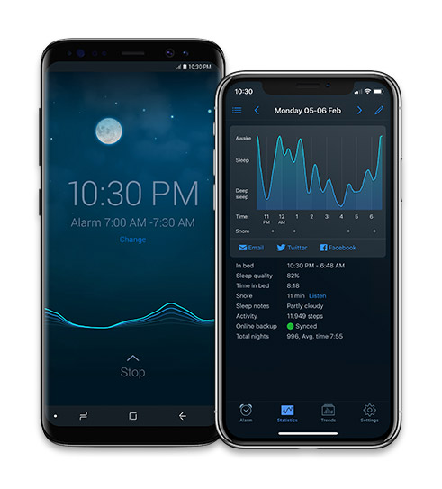
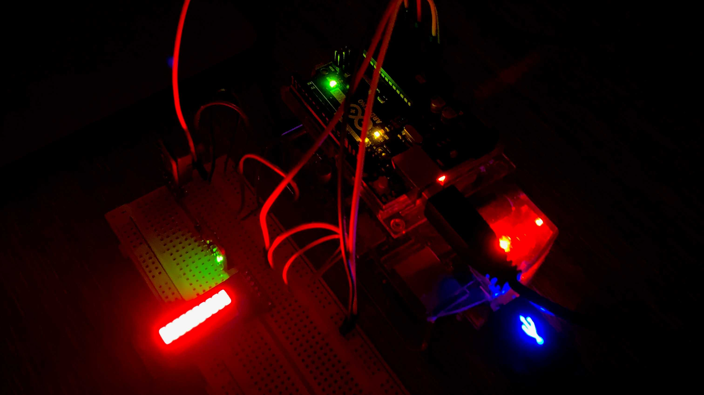
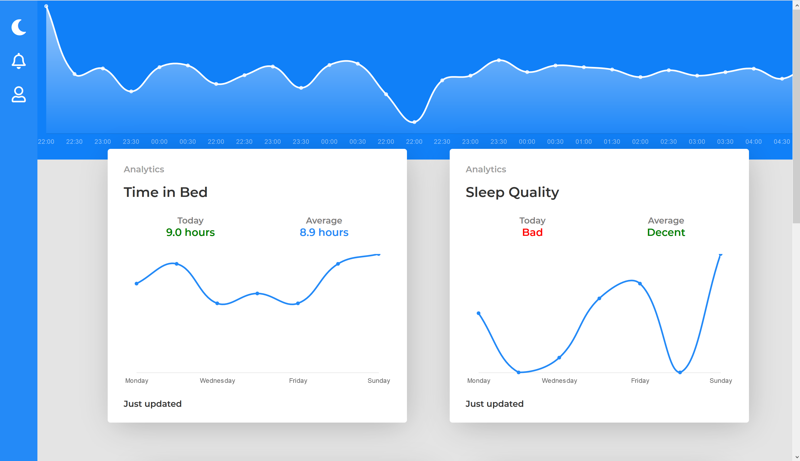

## Nocturnal: A Bedside Arduino-based Sleep Tracker
&nbsp;

*The inspiration for the project.*

I teamed up with [Ishan Chho](https://www.linkedin.com/in/ishanchho/), and we got to work brainstorming ideas for the project. 
Our ideas varied from a selfie drone, to a shoelace tier. But since we were both interested in data analysis at the time, we decided to make a **bedside sleep tracker with an analytics dashboard**. The intention was to make it like [Sleep Cycle](https://www.sleepcycle.com/), but with more sensor inputs and as a standalone device instead.

Here's the final product:

*The microcontroller with all the attached sensors*.

Like Sleep Cycle, the device tracks a person's sleep through the night with a **gyroscope/accelerometer**. We also used a **humidity and temperature sensor** to get an insight on what your ideal sleep conditions look like. Furthermore, to automate the sleep tracking, we used a **lux (light) sensor** to determine when the user was sleeping.

The arduino collects sensor data continuously and using some analysis and adjustments a *Sleep Activity Score* is calculated for every minute. Some of this analysis is calculating the number of 'spikes' in user movement, adjusting sensor inputs, etc. This *Sleep Activity Score*, along with the average value of the gyroscope/accelerometer, is pushed to a spreadsheet every minute using the **Google Sheets API**. Finally, at the end of every sleep session, the total time slept and the sleep conditions for the night are also added to the spreadsheet.

*The IoT dashboard that displays the sleep activity to the user.*

For the companion **Flask** web-app, the data is queried from the spreadsheet and with some more analysis it's displayed on various graphs and widgets on an IoT dashboard using **ChartJS**. The analysis is mostly to display the data in a meaningful way for the user.

&nbsp;

This project was made for the SE 101 course at the University of Waterloo. To read more about the course and the project, check out [my blog post](https://mufeez.me/blog/posts/se101project/)!